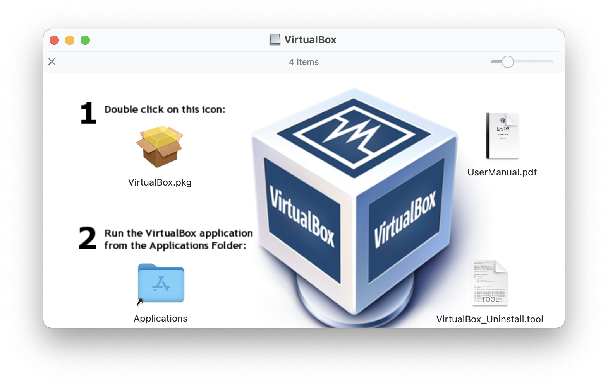
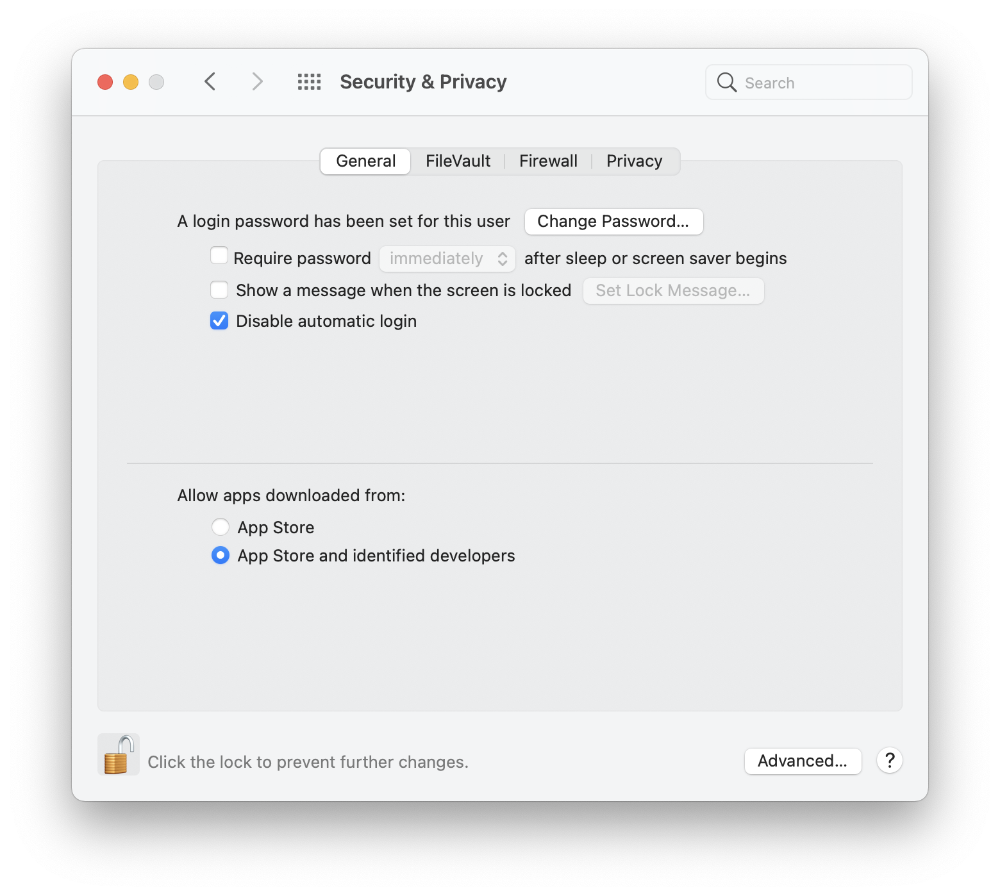
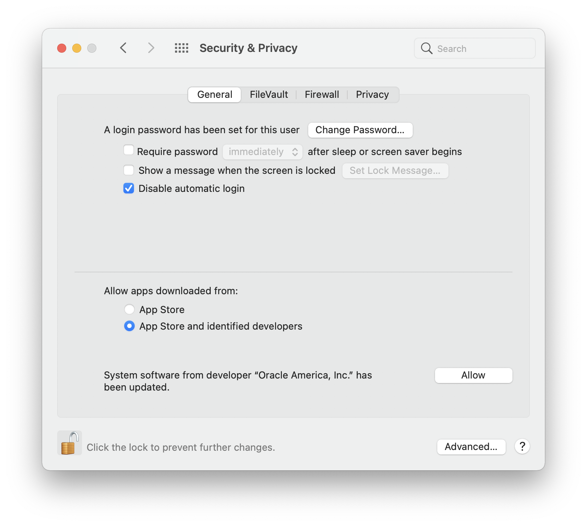

# Install VirtualBox on Big Sur (macOS 11) and Monterey (macOS 12)
VirtualBox relies on installing kernel drivers (kext bundles) in order to function. Unfortunately, Apple are not very keen on developers doing this and have made it difficult for any 3rd party (i.e. Oracle) to install these device drivers. Installation of the drivers can fail unexpectedly if the necessary permissions are not granted by the user (you). I have found the following sequence works for me most of the time. If it fails I repeat the steps which include removal of old or failed VirtualBox installations.

There seem to be many internet guides saying to disable System Integrity Protection (SIP). This should **NEVER** be required to install VirtualBox. If you have disabled SIP in the past then my reccommendation is to re-enable it before going any further. If you have changed permissions on files (as a result of following some guide you found on the internet) possibly the best solution is to re-install macOS.

VirtualBox works on a clean installation of macOS. If the installation has been tampered with, then all bets are off.

Also, be aware that other software also installs device drivers that may compete with VirtualBox for resources and cause crashes as a result. An example is the intel Power Gadget. You should remove this if you have it installed but also want to run VirtualBox.

The **kmutil** command may help identify any conflicting kext bundles that you have installed. In this example, only kexts provided by VirtualBox are installed. All other 3rd party kexts have been uninstalled.
<pre>
<code>
user@machine ~ % /usr/bin/kmutil showloaded --list-only|grep -v apple
No variant specified, falling back to release
  186    3 0xffffff7f9cc6d000 0xb2000    0xb2000    org.virtualbox.kext.VBoxDrv (6.1.26) 37337E1D-D61B-38BA-BD5B-0A8D9BBB7C30 <8 6 5 3 1>
  187    0 0xffffff7f9cd45000 0x4000     0x4000     org.virtualbox.kext.VBoxNetFlt (6.1.26) F204C69C-BD5D-3A22-907F-9E45CB2F4241 <186 8 6 5 3 1>
  188    0 0xffffff7f9cd4a000 0x5000     0x5000     org.virtualbox.kext.VBoxUSB (6.1.26) 0784DD75-85BE-3C02-9386-FF959F30604D <186 185 61 8 6 5 3 1>
  189    0 0xffffff7f9cd3f000 0x2000     0x2000     org.virtualbox.kext.VBoxNetAdp (6.1.26) FB699412-C6ED-3390-85AF-D959FBBC9C79 <186 6 5 1>
</code>
</pre>

## Prerequisites
* **An intel Macintosh computer** running a clean installation of macOS 11 (Big Sur). VirtualBox will not run on Apple Silicon hardware (i.e. the M1 series of machines).
* **An admin account on the machine**. Administrator access is required for the installation and you will be prompted for the administrator password in several steps. You should login as this user.

## Download the software
VirtualBox can be downloaded from <a href="https://www.virtualbox.org/wiki/Downloads">https://www.virtualbox.org/wiki/Downloads</a>. 

You can also download the Oracle VM VirtualBox Extension Pack from the same site. You will need the Extension Pack if your virtual machine uses USB 2.0/3.0 devices. You will find a description of the Extension Pack in Section 1.5 of the User Manual included with the VirtualBox installation.

If you are upgrading VirtualBox you need the matching Extension Pack, which is also available at <a href="https://www.virtualbox.org/wiki/Downloads">https://www.virtualbox.org/wiki/Downloads</a>

## Open the installation disk image
Double click the installer .dmg file to open it. You will see a window similar to this.

### Upgrading from a previous install or failed installation

1. Right click (or ctl-click) **Virtualbox_Uninstall.tool** and select **Open** from the popup menu. You will then see a confirmation dialog. Choose **Open**. This will then run a script to remove any older version of VirtualBox from your system. It will **NOT** remove your virtual machines.
2. Reply to any confirmation requests and enter your password when asked.
3. It may help to manually remove any previously failed kext installations using  
<code>
sudo kmutil clear-staging
</code> 
4. It does not hurt to reboot your machine, but it is not absolutely required.

## Open System Preferences -> Security & Privacy
Open the Security & Privacy pane and unlock it by clicking the lock icon at the lower left.

Enter your password when asked. 

Ensure that you have selected App Store and identified developers as shown below.

## Run the installer
Leave the Security & Privacy pane open. Double click **VirtualBox.pkg** to begin the installation. Unless you absolutely know what you are doing it is best to accept all the defaults.

Enter your password when asked.

If the install finished with no errors then you probably have a successful installation. 

You may receive a popup window asking you to confirm the installation of the kext bundles, in which case your next step will be to take action in the Security & Privacy window

### Successful installation
If the installation proceeds to a successful conclusion with no additional popups or errors, you have finished. This may be the case if you have previously allowed Oracle to install the kext bundles. It is a very good idea to reboot your machine before attempting to run VirtualBox.

### Action required in Security & Privacy
You may receive a popup window asking you to confirm the installation of the kext bundles. 

Navigate to your Security & Privacy window and allow Oracle to install the software. Do not restart your machine at this point, even though you will be prompted to do this. 

Go back to the VirtualBox installer window and complete the installation. 

You should then restart your machine using the Security & Privacy popup window button.

## Install the Oracle VirtualBox Extension Pack
The Extension Pack is released in lock-step with the VirtualBox installer. The versions of the Extension Pack and the VirtualBox release *must* match.

You only need to install the Extension Pack if your VM uses features that they provide. To install the software, double click the file you downloaded. This will start the VirtualBox Manager which will prompt you to complete the installation.

## Disclaimer
This procedure works for me on an iMac 18,3 (2017). You may encounter difficulties and if you do: 

* Did you follow these instructions or make your own assumptions?
* Have you enabled SIP? SIP is enabled by default so if you have never modified the setting there is nothing to do here.
* Please post any questions/errors/difficulties to the VirtualBox forum: [VirtualBox on Mac OS X Hosts](https://forums.virtualbox.org/viewforum.php?f=8&sid=5c1a1b45aa48f63b76fcee8b24e124d5)